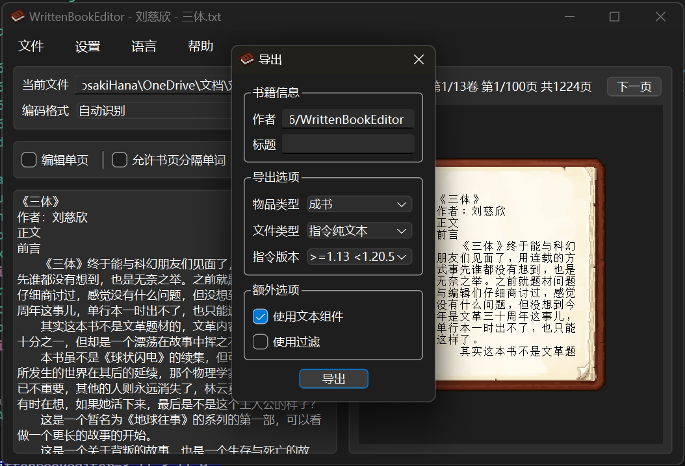

# WrittenBookEditor

A Minecraft book editor written in Python using PySide6.

[English](docs/README_en_US.md)
[简体中文](/README.md)

## Features

- Real-time editing and browsing of book content.
- Supports multiple export formats, including command text files, mcfunction, and data packs.

## Notes

Refer to version 1.21.0's font system; other versions of Minecraft may experience slight misalignment issues.

Enabling "Force Unicode Font" in Minecraft, along with the same setting in this software, can resolve most alignment issues.

## Screenshots

  

## Roadmap

- [x] i18n
- [ ] Support for multiple Minecraft versions
- [ ] Hypertext support
